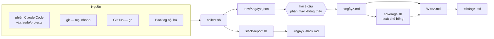

# reflection — Package Usage Guide

README này dành cho **người dùng và người bảo trì** đọc để hiểu cách dùng package. Nó **không** thuộc runtime — skill không load file này khi chạy.

**Mục tiêu:** biến việc ghi nhận công việc từ chỗ *"cuối tuần ngồi nhớ lại"* — một việc vừa mất thời gian vừa ra kết quả thiếu — thành **bản ghi dựng trên bằng chứng, viết bằng giọng của bạn**.

```
(1) dấu vết máy  →  (2) hỏi phần máy không thấy  →  (3) bản ghi ngày  →  (4) tuần  →  (5) tháng
   collect.sh          questions.md                    day                week        month
```

## Vấn đề nó giải

| | |
|---|---|
| **Trí nhớ chọn lọc sai chỗ** | Cuối tuần nhớ lại thì phần nhớ được là phần có commit. Nửa ngày ngồi gỡ rối cho đồng nghiệp, buổi họp làm rõ scope với khách — bay mất, dù đó mới là phần tốn công |
| **Công cụ chỉ thấy phần có dấu vết** | Mọi thứ tự động hoá được đều dừng ở git, PR, ticket. Hỗ trợ team, review giải pháp, điều tra rồi kết luận "không phải lỗi mình" thì không sinh ra dòng log nào |
| **Bản nháp máy viết đọc là biết** | Câu dài nhiều mệnh đề, bài học kiểu "không phải A mà là B", ba gạch đầu dòng cùng một khuôn. Nộp lên thì người đọc biết ngay không phải bạn viết |

> **Dấu vết trả lời được "đã đụng vào gì". Chỉ có bạn trả lời được "hôm nay thực sự làm gì".**

## Dành cho ai

| Vai | Dùng gì | Để làm gì |
|---|---|---|
| **Người viết reflection định kỳ** | `day` → `week` → `month` | Bản ghi tuần/tháng dựng từ bản ghi ngày, không phải ngồi nhớ lại |
| **Người phải báo cáo hằng ngày** | `slack-report.sh` | Danh sách ticket kèm giờ đã log, dán thẳng lên channel |
| **Người bảo trì package** | `references/style-guide.md` | Luật viết — nơi mọi phản hồi "viết dở quá" được ghi lại thành luật kiểm được |

## Entrypoint

```
/reflection day              # hôm nay
/reflection day -1           # hôm qua
/reflection day 2026-08-04
/reflection week             # tuần này
/reflection week 2026-W32
/reflection month            # tháng này
/reflection month 2026-08
```

Bốn script chạy độc lập, không cần Claude:

```bash
scripts/collect.sh 2026-08-04               # gom dấu vết một ngày
scripts/coverage.sh --week 2026-W32         # chỉ ra chỗ hổng
scripts/backlog.sh --plan 2026-08-10 2026-08-14
scripts/slack-report.sh                     # báo cáo ngày, dán lên channel
```

## Ba nguyên tắc cốt lõi

| | Nguyên tắc | Nghĩa khi chạy |
|---|---|---|
| **1** | **Không viết trước khi hỏi** | Dấu vết chỉ phủ phần đụng vào repo. Tóm tắt cho người dùng xem, hỏi, đợi trả lời, rồi mới viết — kể cả khi dữ liệu trông đã đầy đủ |
| **2** | **Không đụng hệ thống của khách hàng** | Backlog chỉ gọi tới đúng một space khai trong config. Ticket của khách chỉ nhận khi người dùng tự dán vào |
| **3** | **Bằng chứng thắng suy đoán** | Ticket có `hours > 0` thì chắc chắn đã làm. Không suy diễn từ trường khác, không gán việc sang ngày nó không xảy ra |

### Nguyên tắc gốc — ai nghĩ, ai gõ

| Quyết định | Vì sao không giao cho máy |
|---|---|
| Hôm nay **thực sự** làm gì | Việc không có commit, không có ticket thì không có dấu vết nào để suy ra |
| Bài học rút ra là gì | Máy kể lại được việc đã làm, nhưng không biết bạn hiểu ra điều gì mà trước đó chưa biết |
| Việc nào **đáng** đưa vào bản ghi | Ba commit sửa typo không ngang một buổi chiều gỡ rối cho đồng nghiệp |

AI gom dấu vết, tóm tắt, đặt câu hỏi, gõ hộ. **Người quyết nội dung.**

## Toàn cảnh



## Nguồn dữ liệu

| Nguồn | Lấy gì | Thiếu thì |
|---|---|---|
| Phiên Claude Code | Câu bạn đã gõ, nhóm theo repo | — |
| git *(mọi nhánh)* | Commit của bạn, file `.md` bị đụng tới | Repo khai trong `.repos` |
| GitHub *(`gh`)* | PR mở, merge, **review**, góp ý | Bỏ qua phần PR, không lỗi |
| Backlog nội bộ | Ticket đã động tới **kèm giờ đã log**, và ticket đã lên lịch kỳ tới | Bỏ qua, không lỗi |
| **Bạn** | Mọi thứ còn lại | Không gì thay thế được |

Dòng cuối là dòng quan trọng nhất: hỗ trợ team, review giải pháp, họp, điều tra, lên kế hoạch — không nguồn nào ở trên thấy được.

Secret gõ nhầm vào chat (`API_KEY=...`, `token=...`) được che trước khi ra khỏi script.

## Cài

```bash
git clone <repo-url> ~/claude-plugins/reflection
```

Khai marketplace trong `~/.claude/settings.json` → `extraKnownMarketplaces`, rồi bật trong `enabledPlugins`. Nếu bạn đã có marketplace kiểu thư mục trỏ vào `~/claude-plugins`, chỉ cần thêm một entry vào `.claude-plugin/marketplace.json`.

**Cần sẵn:** `bash`, `jq`, `git`. `gh` (đã đăng nhập) nếu muốn có phần PR. Chạy được trên macOS và Linux — khác biệt `date`/`stat` giữa BSD và GNU gom hết vào `scripts/_lib.sh`.

## Cấu hình

`~/.config/reflection/config.json` — mọi khoá đều tùy chọn:

```json
{
  "root": "~/reflections",
  "template": "generic",
  "repos": ["~/work/project-a", "~/work/project-b"],
  "backlog": { "base": "https://myspace.backlog.jp" }
}
```

| Khoá | Mặc định | Ghi chú |
|---|---|---|
| `root` | `~/reflections` | Ghi đè bằng `$REFLECT_ROOT` |
| `template` | `generic` | Hoặc `myprofile` |
| `repos` | tự dò | Dò từ trường `cwd` trong phiên Claude. Khai tay nếu có repo chưa từng mở bằng Claude |
| `backlog.base` | *(tắt)* | Space **nội bộ**. Đừng khai space của khách hàng |
| `backlog.apiKey` | — | Hoặc `$BACKLOG_API_KEY`. Để trong file thì `chmod 600` |

| Biến môi trường | Tác dụng |
|---|---|
| `REFLECT_ROOT` | Nơi lưu bản ghi |
| `REFLECT_DAY_START_HOUR` | Mốc mở ngày, mặc định `4` |
| `REFLECT_SKIP_GITHUB` | Bỏ phần PR — `coverage.sh --month` tự bật, giảm 4 phút xuống 25 giây |

## Bốn script

| Script | Việc | Chạy riêng |
|---|---|---|
| `collect.sh [ngày]` | Gom dấu vết một ngày. `--json` cho máy đọc | ✔ |
| `coverage.sh --week\|--month` | Ngày chưa ghi · ticket bị bỏ sót · tuần chưa tổng hợp | ✔ |
| `backlog.sh <từ> [đến]` | Ticket đã động tới, kèm giờ và trạng thái | ✔ |
| `backlog.sh --plan <từ> <đến>` | Ticket chưa đóng có lịch trong kỳ — cho mục việc tiếp theo | ✔ |
| `slack-report.sh [ngày]` | `Today` kèm giờ · `Tomorrow` kèm `continue` | ✔ |

`_lib.sh` chỉ để `source`, không chạy trực tiếp.

### Vì sao hai chế độ Backlog dùng hai bộ tiêu chí

| Chế độ | Lọc theo | Trả lời câu |
|---|---|---|
| mặc định | **hoạt động** trong ngày | đã đụng vào gì |
| `--plan` | `startDate`–`dueDate`, chưa đóng | sắp tới phải làm gì |

Lọc việc đã làm theo hạn chót thì một ticket kéo dài hai tuần sẽ hiện lại mỗi ngày, kể cả ngày không đụng tới. Ngược lại, lọc kế hoạch theo hoạt động thì không thấy được việc chưa bắt đầu.

Số giờ trong ngày tính bằng tổng **chênh lệch** `actualHours` từ các lần bạn sửa, không phải con số tích luỹ của ticket — nên ticket kéo dài nhiều ngày vẫn ra đúng giờ của riêng hôm đó.

## Nơi lưu

```
~/reflections/
  .raw/                        ← snapshot JSON, KHÔNG commit (chứa nguyên văn prompt)
  2026-08/
    W1/  2026-08-03.md  2026-08-03-slack.md  …  W1.md
    W2/  …                                       W2.md
    2026-08.md
```

Tuần đánh số theo **vị trí trong tháng** (W1 là tuần chứa ngày 1), không phải số tuần ISO — người ta nhớ "tuần 2 của tháng 8" chứ ít ai nhớ "tuần 32".

Ngày làm việc tính từ **04:00 tới 04:00 hôm sau**, vì commit lúc 1h sáng gần như luôn thuộc về ngày hôm trước.

## Cấu trúc package

```
reflection/
├── .claude-plugin/plugin.json
├── commands/reflection.md              ← /reflection day|week|month
└── skills/reflection/
    ├── SKILL.md                        ← luồng ngày · tuần · tháng
    ├── references/
    │   ├── style-guide.md              ← luật viết + ví dụ sai/đúng
    │   └── questions.md                ← hỏi gì để lấp phần máy không thấy
    ├── scripts/                        ← 4 script + _lib.sh
    └── templates/
        ├── generic-{day,week,month}.md
        └── myprofile-{day,week,month}.md
```

`style-guide.md` là file đáng đọc nhất với người bảo trì: mỗi luật trong đó ứng với một lỗi mà bản nháp đầu tay đã mắc phải, kèm ví dụ ✗/✓ lấy từ bản thật.

## Tự động hoá — nếu bạn muốn

Package **không cài lịch chạy nền**. Muốn có thì tự đặt, ví dụ một LaunchAgent gọi `collect.sh --json` cuối mỗi ngày làm việc và lưu vào `<root>/.raw/`. Skill tự phát hiện snapshot có sẵn và dùng thay vì gom lại — nhanh hơn, và giữ đúng dấu vết tại thời điểm cuối ngày hôm đó, kể cả khi vài hôm sau bạn mới ngồi viết.

> ⚠ Trên macOS, `display notification` gọi từ `launchd` bị nuốt im lặng — tiến trình không mang bundle ID nên không đăng ký được vào System Settings, mà `osascript` vẫn trả exit 0. Dùng `display alert ... giving up after N`.

Đừng để lịch tự chạy `claude -p "/reflection day"`: chế độ headless không hỏi được, nên bản ghi sẽ chỉ có việc đụng repo — mất đúng phần đáng ghi nhất.

## Cái này không làm

- **Không tự viết thay bạn.** Nó gom, hỏi, gõ hộ. Nội dung là của bạn.
- **Không đụng hệ thống của khách hàng.** Một space Backlog duy nhất, khai trong config.
- **Không sửa repo.** Chỉ đọc git, chỉ ghi vào thư mục lưu bản ghi.
- **Không cài tiến trình chạy nền.**
- **Không đồng bộ lên đâu cả.** Bản ghi nằm trên máy bạn.
